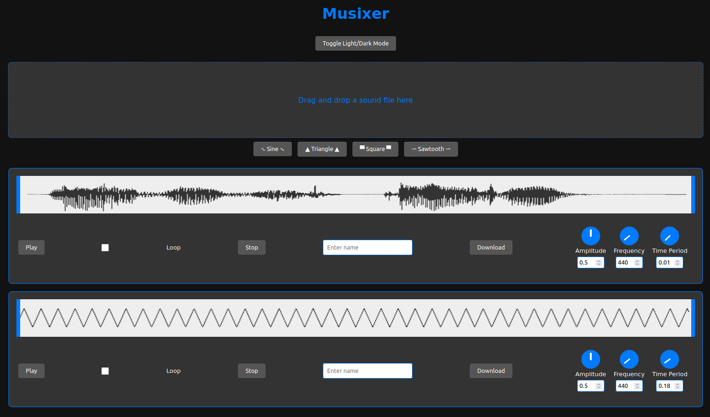

# musixer
some kind of music making/mixing software

## rewritten version

## old version (see commit log)

### TODO

#### Effects

There should be a panel for selecting effects to put on a soundclip when editing it. Effects to implement:

- [ ] Reverb
- [ ] Delay/Echo
- [ ] Chorus
- [ ] Flanger
- [ ] Phaser
- [ ] Distortion/Overdrive
- [ ] Compression
- [ ] Equalization (EQ)
- [ ] Pitch Shift
- [ ] Time Stretching
- [ ] Limiter
- [ ] Bitcrusher

#### Timeline

Downloaded files should appear in a list where you can select them and put them on a timeline. The timeline should have multiple layers. You should be able to play all layers at once or choose what layers you want to play.